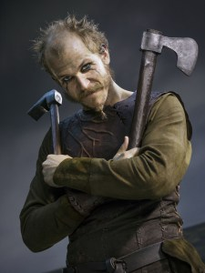

# floki 

AI Chatbot for Kubernetes Operations to quickly diagnose and respond to common operations and developer issues.  While Kubernetes may be the "Helmsman" for your container ship, the goal of Floki is to help you build and steer your ship to your chosen destination.  The character Floki was chosen from the historical Norseman (http://thedockyards.com/the-historical-truth-behind-floki/) and popular Vikings TV series. 
